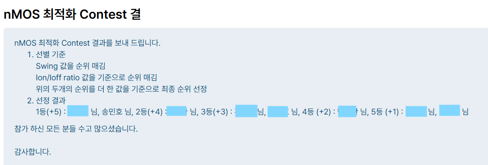
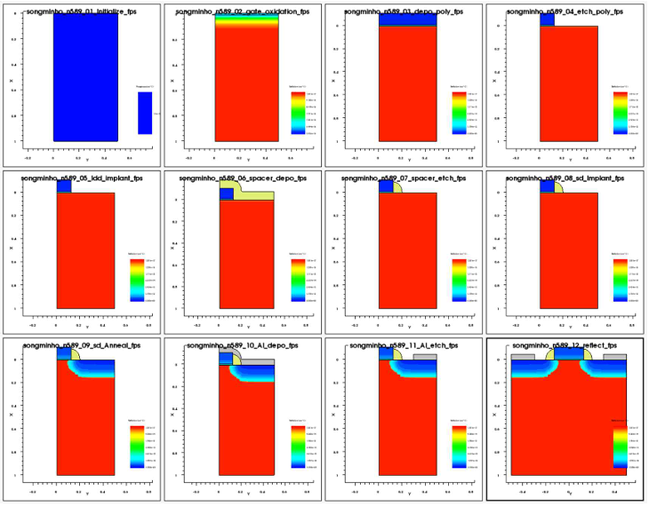

# TCAD MOSFET Process and Device Optimization

Synopsys Sentaurus TCAD를 활용하여 nMOS의 성능을 최적화하고, 수업에서 제공된 SimpleMOS 기준 공정을 PMOS 공정으로 변환한 뒤 주요 공정 변수를 최적화한 개인 프로젝트입니다.

본 프로젝트는 다음 두 작업으로 구성됩니다.

1. 수업 내 nMOS 성능 최적화 콘테스트
2. PMOS 공정 변환 및 5개 공정 변수 최적화

---

## Project Information

| Item | Description |
| :--- | :--- |
| Course | 반도체집적공정 |
| Term | 2026-1 |
| Project Type | Individual Project |
| Simulation Tool | Synopsys Sentaurus TCAD |
| Modules | Sentaurus Workbench, Sprocess, Sdevice, Svisual |
| Scope | Process Simulation, Device Simulation, Parameter Sweep, Electrical Characterization |

---

# 1. nMOS Performance Optimization

## 1.1 Objective

수업에서 제공된 SimpleMOS 구조를 기준으로 게이트 길이, 기판 도핑 농도, 산화 시간, LDD 조건 및 Source/Drain 조건을 조절하여 nMOS의 스위칭 성능을 최적화하였습니다.

콘테스트 평가는 다음 두 지표의 순위를 합산하는 방식으로 진행되었습니다.

- Subthreshold Swing
- Ion/Ioff Ratio

## 1.2 Recognition

### Co-1st Place in an In-Course nMOS Optimization Contest

반도체집적공정 수업에서 진행된 nMOS 최적화 콘테스트에서 Subthreshold Swing과 Ion/Ioff Ratio 순위를 종합한 결과 공동 1위를 기록하였습니다.

본 결과는 외부 경진대회 수상이 아닌 교과목 내 성능 최적화 콘테스트 결과입니다.

## 1.3 Final nMOS Parameters

| Parameter | Final Value |
| :--- | :--- |
| Gate Length | 0.25 µm |
| Substrate Doping Concentration | 1.0 × 10¹⁷ cm⁻³ |
| Gate Oxidation Time | 10 |
| LDD Dose | 6.5 × 10¹² cm⁻² |
| LDD Implant Energy | 15 keV |
| Source/Drain Dose | 5.0 × 10¹⁴ cm⁻² |
| Source/Drain Implant Energy | 7 keV |
| Drain Voltage | 1.0 V |
| Oxide Thickness | 0.0101 µm |

## 1.4 Final nMOS Performance

| Metric | Result |
| :--- | :--- |
| Threshold Voltage, Vtgm | 1.086 V |
| Transconductance, gm | 1.779 × 10⁻⁴ |
| Drain Current | 2.511 × 10⁻⁴ A/µm |
| Off Current, Ioff | 4.059 × 10⁻¹⁶ A/µm |
| Ion/Ioff Ratio | 6.186 × 10¹¹ |
| Subthreshold Swing | 82.953 mV/dec |

보고서에 기록된 기준 조건과 비교했을 때 Ion/Ioff Ratio를 3000% 이상 개선하면서 Subthreshold Swing을 82.953 mV/dec 수준으로 유지하였습니다.

<p align="center">
  
</p>

<details>
<summary><strong>Contest Result Evidence</strong></summary>

<br>

<p align="center">
  
</p>

</details>

> nMOS 콘테스트 당시 실행한 원본 Sentaurus command 파일은 보존되어 있지 않습니다. 따라서 본 저장소에는 보고서에 기록된 최종 파라미터와 성능 결과만 공개합니다.

---

# 2. PMOS Process Conversion

## 2.1 Objective

수업에서 제공된 nMOS 기반 SimpleMOS 공정을 PMOS 구조로 변환하고, 주요 공정 변수가 Ion, Ioff, Ion/Ioff Ratio 및 Subthreshold Swing에 미치는 영향을 분석하였습니다.

## 2.2 Baseline and Modification Scope

본 프로젝트는 수업에서 제공된 SimpleMOS 기준 코드를 바탕으로 수행하였습니다.

프로젝트 목적에 맞게 다음 내용을 수정하고 확장하였습니다.

- p형 기판 기반 nMOS 구조를 Phosphorus 도핑 N-Well 기반 PMOS 구조로 변환
- LDD 및 Source/Drain 주입 이온을 Boron으로 변경
- LDD Dose 및 Implant Energy 변수화
- Source/Drain Dose 및 Implant Energy 변수화
- Rapid Thermal Annealing 시간 변수화
- 주요 공정 단계별 TDR 구조 출력 추가
- PMOS 동작을 위한 음의 게이트 전압 sweep 구성
- Vtgm, Drain Current, Ioff, SS 및 gm 자동 추출 구성

## 2.3 Process Flow

1. Phosphorus 기반 N-Well 초기화
2. Thermal Gate Oxidation
3. Poly-Silicon Deposition
4. Gate Patterning and Etching
5. Boron LDD Implantation
6. Nitride Spacer Formation
7. Boron Source/Drain Implantation
8. Rapid Thermal Annealing
9. Aluminum Contact Formation
10. Structure Reflection and Electrode Definition

<p align="center">
  
</p>

---

# 3. PMOS Process Parameter Optimization

## 3.1 Optimization Variables

Gate Length, Gate Oxidation Time 및 N-Well 농도를 고정한 상태에서 다음 다섯 개 공정 변수를 최적화하였습니다.

| Variable | Engineering Purpose | Selected Value |
| :--- | :--- | :--- |
| LDD Dose | 누설 전류와 Drain 전계 제어 | 1.0 × 10¹² cm⁻² |
| LDD Energy | LDD 접합 깊이 제어 | 3 keV |
| Source/Drain Dose | 구동 전류와 누설 전류의 균형 | 6.0 × 10¹⁵ cm⁻² |
| Source/Drain Energy | Shallow Junction 형성 | 1 keV |
| RTA Time | 도펀트 활성화와 측면 확산 제어 | 1 s |

## 3.2 Optimization Strategy

LDD Dose를 우선 조절하여 누설 전류와 Subthreshold Swing 조건을 확보한 뒤, 나머지 변수를 순차적으로 조절하였습니다.

주요 분석 관점은 다음과 같습니다.

- Dose 증가에 따른 Ion 향상과 Ioff 증가 사이의 trade-off
- Implant Energy 변화에 따른 접합 깊이 변화
- RTA 시간 증가에 따른 Boron의 측면 확산
- 단채널 효과와 게이트의 채널 제어력
- 개별 공정 변수 사이의 상호작용

---

# 4. Final PMOS Performance

PMOS의 전압과 전류는 음의 방향으로 계산됩니다. 아래 전류 성능값은 로그 스케일 표현과 비교 편의를 위해 절댓값으로 표시하였습니다.

## 4.1 Final Process Parameters

| Parameter | Final Value |
| :--- | :--- |
| Gate Length | 0.25 µm |
| N-Well Concentration | 1.0 × 10¹⁷ cm⁻³ |
| Gate Oxidation Time | 10 |
| LDD Dose | 1.0 × 10¹² cm⁻² |
| LDD Implant Energy | 3 keV |
| Source/Drain Dose | 6.0 × 10¹⁵ cm⁻² |
| Source/Drain Implant Energy | 1 keV |
| RTA Time | 1 s |
| Drain Voltage | -1.0 V |
| Gate Voltage Range | 0 V to -2.5 V |
| Oxide Thickness | 0.0101 µm |

## 4.2 Electrical Results

| Metric | Design Target | Final Result |
| :--- | :--- | :--- |
| Absolute Ion | > 1.0 × 10⁻⁵ A/µm | 1.120 × 10⁻⁴ A/µm |
| Absolute Ioff | < 1.0 × 10⁻¹⁴ A/µm | 1.707 × 10⁻¹⁶ A/µm |
| Subthreshold Swing | < 100 mV/dec | 83.677 mV/dec |
| Ion/Ioff Ratio | — | 6.561 × 10¹¹ |
| Threshold Voltage, Vtgm | Enhancement-mode PMOS | -1.173 V |

최종 조건에서 Ion, Ioff 및 Subthreshold Swing에 대해 설정된 세 가지 설계 목표를 모두 만족하였습니다.

<p align="center">
  
</p>

---

# 5. Technical Interpretation

## LDD Dose

낮은 LDD Dose 조건은 Drain 부근의 누설 전류를 줄이고 높은 Ion/Ioff Ratio를 확보하는 데 유리했습니다.

## Implant Energy

LDD Energy 3 keV 조건에서 Ion/Ioff Ratio와 Subthreshold Swing 사이의 균형이 가장 우수했습니다.

Source/Drain Energy를 1 keV로 낮추어 얕은 접합을 형성하고 단채널 효과를 억제하였습니다.

## Rapid Thermal Annealing

RTA 시간이 증가하면 Boron의 측면 확산이 증가하여 채널 유효 길이가 감소하고 누설 전류가 증가할 수 있습니다.

RTA 시간을 1초로 제한하여 과도한 도펀트 확산을 억제하였습니다.

## Trade-off Analysis

각 변수를 개별적으로 최대화하기보다 다음 성능 사이의 trade-off를 종합적으로 고려하였습니다.

- 높은 구동 전류
- 낮은 Off Current
- 높은 Ion/Ioff Ratio
- 낮은 Subthreshold Swing
- Enhancement-mode PMOS 동작

---

# 6. Simulation Workflow

```text
Sentaurus Workbench
        |
        v
Sprocess
  - PMOS process structure generation
  - Implantation and annealing
  - Contact formation
  - TDR structure output
        |
        v
Sdevice
  - Device-physics model configuration
  - Drain-voltage ramp
  - Negative gate-voltage sweep
        |
        v
Svisual
  - Id-Vg curve generation
  - Vtgm extraction
  - Ion and Ioff extraction
  - Subthreshold Swing extraction
  - Transconductance extraction
```

---

# 7. Workbench Parameters

본 프로젝트의 Workbench simulation에 사용되는 주요 변수는 다음과 같습니다.

| Parameter | Description |
| :--- | :--- |
| `Lg` | Gate Length |
| `NWell` | N-Well Doping Concentration |
| `GOxTime` | Gate Oxidation Time |
| `LDD_Dose` | LDD Implantation Dose |
| `LDD_E` | LDD Implantation Energy |
| `SD_Dose` | Source/Drain Implantation Dose |
| `SD_E` | Source/Drain Implantation Energy |
| `RTA` | Rapid Thermal Annealing Time |
| `Vd` | Drain Voltage |

---

# 8. Sentaurus Workbench Source Code

본 코드는 수업에서 제공된 SimpleMOS baseline을 바탕으로 PMOS 구현 및 공정 최적화 목적에 맞게 수정한 코드입니다.

주요 수정 사항은 다음과 같습니다.

- Phosphorus 기반 N-Well 구성
- Boron 기반 LDD 및 Source/Drain implantation
- 공정 변수의 Workbench parameterization
- 주요 공정 단계별 구조 출력
- PMOS 음전압 sweep
- 주요 전기적 성능 지표 자동 추출

## 8.1 Sprocess

<details>
<summary><strong>View SPROCESS Code</strong></summary>

```tcl
# PMOS Process Simulation
# Developed from a course-provided SimpleMOS baseline.
#
# Main modifications:
# - Configured a Phosphorus-doped N-Well
# - Replaced n-type LDD and source/drain implants with Boron
# - Parameterized implantation dose and energy
# - Parameterized RTA time
# - Added TDR output after each major process step

#header
#endheader

line x location= 0    spacing= 0.01 tag= top
line x location= 0.15 spacing= 0.02
line x location= 1.0  spacing= 0.2  tag= bottom

line y location= 0.0      spacing= 0.1*@Lg@  tag= left
line y location= 0.5*@Lg@ spacing= 0.05*@Lg@
line y location= 2*@Lg@   spacing= @Lg@      tag= right

region Silicon xlo= top xhi= bottom ylo= left yhi= right

## Initialize N-Well
init concentration= @NWell@ field= Phosphorus slice.angle= 180 !DelayFullD

struct tdr= pmos_n@node@_01_initialize !Gas !interfaces

## Configure dopant diffusion model
pdbSet Silicon Dopant DiffModel ChargedFermi

## Gate oxidation
pdbSet Oxide Grid perp.add.dist 0.01e-4
diffuse time= @GOxTime@ temperature= 950 O2

struct tdr= pmos_n@node@_02_gate_oxidation !Gas !interfaces

## Extract oxide thickness
set oxidelayer [lindex [layers y=0 Oxide] 1]
puts "DOE: tox [format %.4f [expr [lindex $oxidelayer 1] - [lindex $oxidelayer 0]]]"

## Poly-Si deposition
deposit PolySilicon type= anisotropic thickness= 0.1

struct tdr= pmos_n@node@_03_poly_deposition !Gas !interfaces

## Gate mask
mask name= poly left= -@Lg@/2 right= @Lg@/2

## Gate etching
etch PolySilicon type= anisotropic thickness= 0.12 mask= poly
etch Oxide type= anisotropic thickness= 0.02

struct tdr= pmos_n@node@_04_gate_etch !Gas !interfaces

## Boron LDD implantation
implant Boron dose= @LDD_Dose@ energy= @LDD_E@

struct tdr= pmos_n@node@_05_ldd_implant !Gas !interfaces

## Nitride spacer deposition
deposit Nitride type= isotropic thickness= 0.3*@Lg@

struct tdr= pmos_n@node@_06_spacer_deposition !Gas !interfaces

## Nitride spacer etching
etch Nitride type= anisotropic thickness= 0.35*@Lg@

struct tdr= pmos_n@node@_07_spacer_etch !Gas !interfaces

## Boron Source/Drain implantation
implant Boron dose= @SD_Dose@ energy= @SD_E@

struct tdr= pmos_n@node@_08_sd_implant !Gas !interfaces

## Rapid Thermal Annealing
diffuse time= @RTA@<s> temperature= 1000

struct tdr= pmos_n@node@_09_sd_anneal !Gas !interfaces

## Aluminum deposition
deposit Aluminum type= anisotropic thickness= 0.05

struct tdr= pmos_n@node@_10_Al_deposition !Gas !interfaces

## Aluminum contact etching
mask name= contact left= @Lg@*1.2
etch Aluminum type= anisotropic thickness= 0.1 mask= contact

struct tdr= pmos_n@node@_11_Al_etch !Gas !interfaces

## Reflect structure
transform reflect left

struct tdr= pmos_n@node@_12_reflect !Gas !interfaces

## Electrode definition
contact name= substrate bottom
contact name= source point y= -@Lg@*1.5 x= -0.010 replace
contact name= drain  point y=  @Lg@*1.5 x= -0.010 replace
contact name= gate   point y= 0          x= -0.050

## Save final structure
struct tdr= n@node@ !Gas !interfaces
```

</details>

---

## 8.2 Sdevice

<details>
<summary><strong>View SDEVICE Code</strong></summary>

```text
File {
   Grid    = "@tdr@"
   Plot    = "@tdrdat@"
   Current = "@plot@"
   Output  = "@log@"
}

Electrode {
   { Name="source"    Voltage= 0.0 }
   { Name="drain"     Voltage= 0.0 }
   { Name="gate"      Voltage= 0.0 }
   { Name="substrate" Voltage= 0.0 }
}

Physics {
   EffectiveIntrinsicDensity(OldSlotboom)
}

Physics(Material="Silicon") {
   Mobility(
      PhuMob
      HighFieldSaturation
      Enormal
   )

   Recombination(
      SRH(DopingDependence)
   )
}

Math {
   Extrapolate
   Iterations= 20
   ExitOnFailure
}

Solve {
   *- Create initial solution

   Coupled(Iterations= 100) {
      Poisson
   }

   Coupled {
      Poisson
      Electron
      Hole
   }

   *- Ramp drain voltage to @Vd@

   Quasistationary(
      InitialStep= 0.1
      Increment= 1.5
      MinStep= 1e-5
      MaxStep= 1

      Goal {
         Name="drain"
         Voltage= @Vd@
      }
   ) {
      Coupled {
         Poisson
         Electron
         Hole
      }
   }

   *- Sweep gate voltage from 0 V to -2.5 V

   NewCurrentPrefix="IdVg_"

   Quasistationary(
      DoZero
      InitialStep= 0.01
      Increment= 1.5
      MinStep= 1e-5
      MaxStep= 0.05

      Goal {
         Name="gate"
         Voltage= -2.5
      }
   ) {
      Coupled {
         Poisson
         Electron
         Hole
      }
   }
}
```

</details>

---

## 8.3 Svisual

<details>
<summary><strong>View SVISUAL Code</strong></summary>

```tcl
# PMOS Id-Vg Visualization and Parameter Extraction
#
# Extracted metrics:
# - Vtgm
# - Drain current
# - Ioff
# - Subthreshold Swing
# - Transconductance

#setdep @node|sdevice@

set n @node|sdevice@

## Determine Sdevice node status
set status @[gproject::GetNodeStatus @node|sdevice@]@

## Create a one-dimensional plot if it does not exist
if {[llength [list_plots Plot_1D]] == 0} {
  create_plot -1d -name Plot_1D
  select_plots Plot_1D

  set_plot_prop -hide_title -show_legend
  set_axis_prop -title_font_size 16 -scale_font_size 14
  set_axis_prop -axis x -title "Gate Voltage (V)" -type linear
  set_axis_prop -axis y -title "Drain Current (A/<greek>m</greek>m)" -type log
  set_legend_prop -label_font_size 14 -location bottom_right
}

## Load Sdevice result
load_file @[relpath IdVg_n@node|sdevice@_des.plt]@ -name PLT($n)

## Create Id-Vg curve
create_curve -name IdVg($n) -dataset PLT($n) \
  -axisX "gate InnerVoltage" \
  -axisY "drain TotalCurrent"

## Extract electrical parameters
if {$status == "done"} {
  load_library extract

  set Vgs [get_variable_data "gate OuterVoltage" -dataset PLT($n)]
  set Ids [get_variable_data "drain TotalCurrent" -dataset PLT($n)]

  ext::ExtractVtgm \
    out=Vtgm \
    name=Vtgm \
    v=$Vgs \
    i=$Ids

  ext::ExtractExtremum \
    out=Id \
    name=Id \
    x=$Vgs \
    y=$Ids \
    type=min

  ext::ExtractExtremum \
    out=Ioff \
    name=Ioff \
    x=$Vgs \
    y=$Ids \
    type=max

  ext::ExtractSS \
    out=SS \
    name=SS \
    v=$Vgs \
    i=$Ids \
    vo=[expr $Vtgm/3.0]

  ext::ExtractGm \
    out=gm \
    name=gm \
    v=$Vgs \
    i=$Ids
}

## Apply Workbench-provided curve properties
if {[info exists runVisualizerNodesTogether]} {
  set_curve_prop IdVg($n) \
    -label "IdVg $legend" \
    -color $color \
    -line_style $line \
    -line_width 3
} else {
  puts "Select the Sdevice and Svisual nodes together."
  puts "Then run the selected Visualizer nodes."
}
```

</details>

---

# 9. Project Files

| File | Description |
| :--- | :--- |
| [`nmos-optimization.png`](./nmos-optimization.png) | nMOS 최적화 결과 |
| [`nmos-contest-result.png`](./nmos-contest-result.png) | 수업 내 nMOS 콘테스트 공동 1위 증빙 |
| [`pmos-process-structure.png`](./pmos-process-structure.png) | PMOS 공정 구조 |
| [`pmos-optimization.png`](./pmos-optimization.png) | PMOS 최적화 결과 |
| [`Project_Report.pdf`](./Project_Report.pdf) | 전체 프로젝트 보고서 |

---

# 10. Project Report

프로젝트의 전체 공정 설계 과정, parameter sweep, 성능 비교 및 결과 분석은 아래 보고서에서 확인할 수 있습니다.

[View Project Report](./Project_Report.pdf)

---

# 11. Limitations

- 본 프로젝트는 수업에서 제공된 SimpleMOS baseline을 바탕으로 수행하였습니다.
- 결과는 실제 제작 소자의 측정값이 아닌 TCAD simulation 결과입니다.
- nMOS 콘테스트 당시 사용한 원본 command 파일은 보존되어 있지 않습니다.
- PMOS source code는 보고서에 기록된 Workbench 코드를 바탕으로 정리하였습니다.
- simulation 재현을 위해서는 정식 라이선스가 설치된 Synopsys Sentaurus 환경이 필요합니다.
- Workbench parameter와 node 연결 설정은 사용 환경에 맞게 구성해야 합니다.
