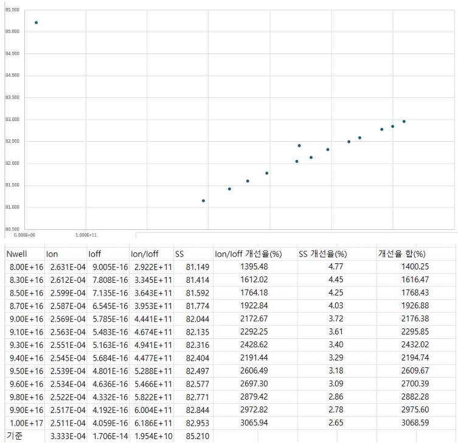
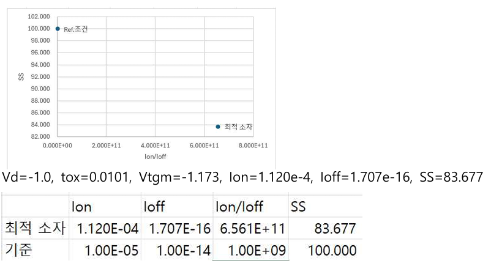

# 1st Place in NMOS Contest & PMOS Optimization

## 1. NMOS Performance Optimization (1st Place) 
* **Goal:** 기존 SimpleMOS 코드를 기반으로 최고 성능의 NMOS 최적화 
* **Achievement:** 다변수 스윕(Sweep) 분석을 통해 타겟 사양을 완벽히 만족하며 **전체 콘테스트 1위** 달성.
* **Key Approach:** 소자 구조 및 도핑 프로파일의 정밀 튜닝을 통해 Ion/Ioff 비율 극대화.

## 2. PMOS Device Fabrication & Optimization
NMOS 설계 모델을 기반으로, PMOS 소자 제작을 위한 공정 변환 및 성능 최적화 과정을 수행하였습니다.

### 2.1 Process Design & Transformation
* **Substrate Change:** P-type 기판에서 Phosphorus 도핑을 통한 **N-Well 기반 PMOS** 구조로 변환.
* **Ion Implantation:** Source/Drain 및 LDD 영역의 주입 이온을 Arsenic에서 **Boron(p-type)**으로 변경.
* **Operation Voltage:** 게이트 전압 범위를 0 ~ -2.5V로 재설정하여 PMOS 구동 환경 최적화.

### 2.2 Optimization Parameters
설계 가이드라인(Id > 1e-5, SS < 100, Ioff < 1e-14)을 충족하기 위해 다음 5가지 핵심 변수를 제어하였습니다.
1. **LDD_Dose & LDD_E:** 단채널 효과 억제 및 게이트 제어력 극대화 (최적값: 3keV).
2. **SD_Dose & SD_E:** 접합 깊이(Junction Depth) 조절을 통한 Ioff 저감 (최적값: 1keV).
3. **RTA (Rapid Thermal Annealing):** 도펀트의 과도한 확산 방지를 위해 공정 시간을 1초로 최적화.

### 2.3 Final Performance Results
도출된 최종 파라미터($Lg=0.25, NWell=1e+17, GoxTime=10, LDD\_Dose=1e+12, LDD\_E=3, SD\_Dose=6e+15, SD\_E=1, RTA=1$) 적용 결과입니다.

| Metric | Result |
| :--- | :--- |
| **Ion (A/µm)** | 1.120e-4 |
| **Ioff (A/µm)** | 1.707e-16 |
| **SS (mV/dec)** | 83.677 |
| **Ion/Ioff Ratio** | 6.561e+11 |

* **Analysis:** 초기 설계 대비 **Ion/Ioff Ratio를 3000% 이상 개선**하여 매우 높은 스위칭 효율을 확보하였습니다.

---

## 3. Skills & Tools
* **Tools:** Synopsys TCAD (Sprocess, Sdevice, Svisual)
* **Methodology:** Device Physics, Parameter Sweep Optimization, Process Flow Modeling

## Project Report
본 프로젝트의 상세 설계 과정과 시뮬레이션 데이터 분석 내용이 담긴 리포트 전문입니다.

[프로젝트 리포트 PDF](반도체집적공정_중간고사대체리포트_송민호.pdf)

---
> 본 프로젝트는 Synopsys TCAD 시뮬레이션을 통해 물리적 공정 변수가 소자 성능에 미치는 영향을 데이터 기반으로 입증하는 데 중점을 두었습니다.
